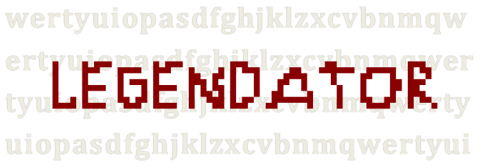

# Legendator

> Simple gem which provides SubRip subtitles parsing methods.

## Using

### Getting Started

1. Make sure you have the main dependencies to run this project:

  - [Ruby](https://www.ruby-lang.org/)

2. And install it with:

  `gem install legendator`

### Next steps

Hang on... A much better documentation will come as soon as this project gets ready for use.

## Contributing

### Versioning

It is intended to maintain this project under the [Semantic Versioning] (http://semver.org/) guidelines. Releases will
be numbered with the following format:

`<major>.<minor>.<patch>`

### Reporting a bug

1. Look for any related issues [here](https://github.com/pogist/legendator/issues).
2. If you find an issue that seems related, please comment there instead of creating a new issue. If it is determined to be a unique bug, we will let you know that a new issue can be created.
3. If you find no related issue, create a new issue by clicking [here](https://github.com/pogist/legendator/issues/new).
If we find an issue that's related, we will reference it and close your issue, showing you where to follow the bug.
4. Tell us important details like what operating system you are using.
5. Include any errors that may be displayed.
6. Update us if you have any new info, or if the problem resolves itself!

### The 5 magic steps

1. Fork it!
2. Create your feature branch: `git checkout -b my-new-feature`
3. Commit your changes: `git commit -m 'Add some feature'`
4. Push to the branch: `git push origin my-new-feature`
5. Submit a pull request :)

## License

[legendator](https://github.com/pogist/legendator/) is distributed under the
MIT License, available in this repository. All contributions are assumed to be also licensed under
the MIT License.
